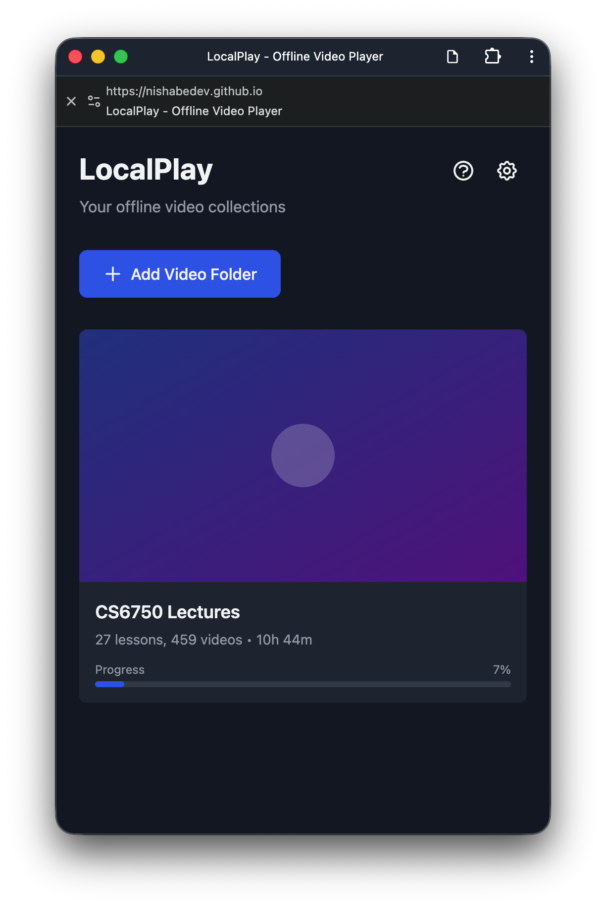
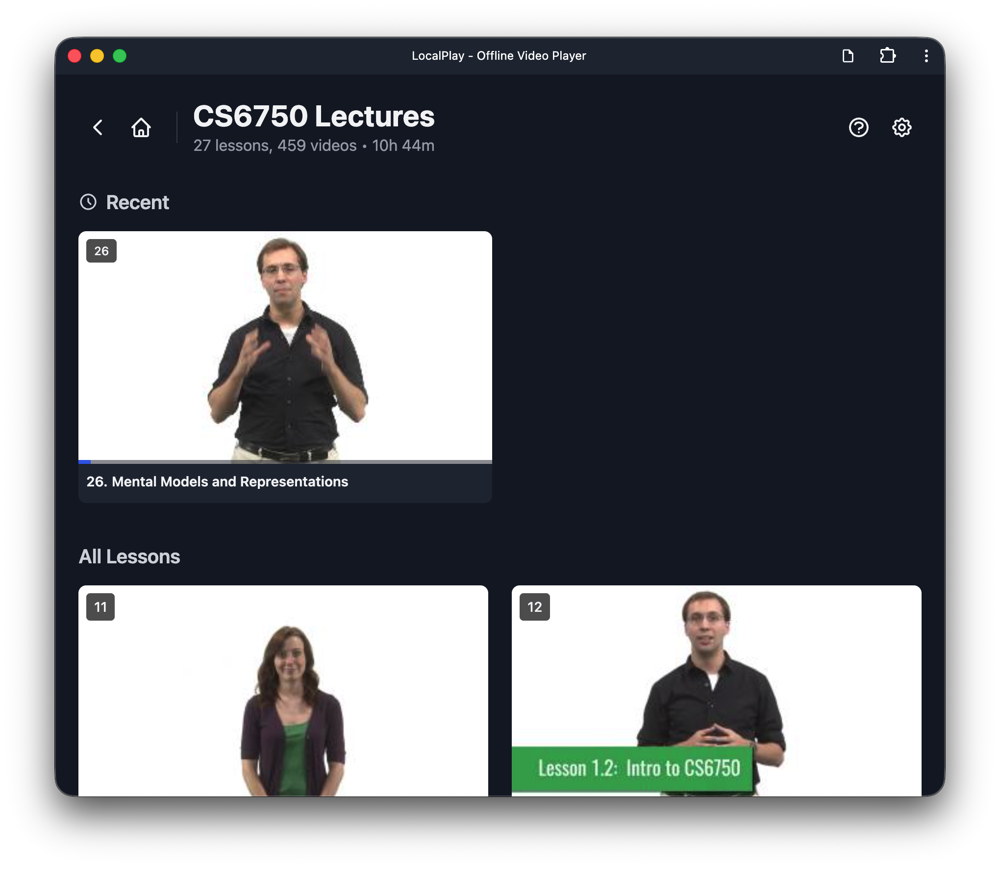
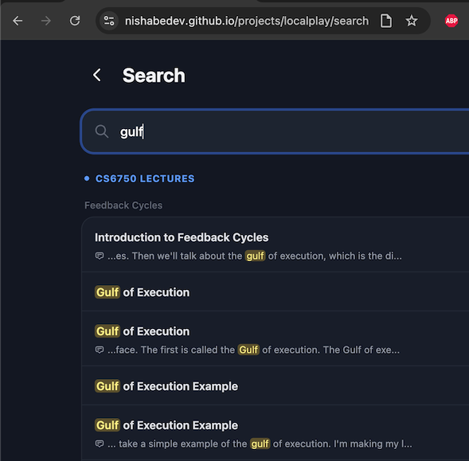
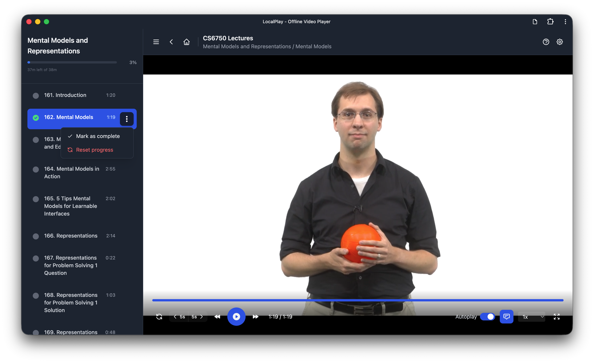

# LocalPlay

**Offline video player for organized video collections**

LocalPlay is a Progressive Web App (PWA) built with React and TypeScript that lets you organize and watch your video collections offline. Perfect for university courses, tutorials, movies, or any video content stored locally on your computer.

<details>
<summary><strong>Screenshots</strong></summary>
<br>
<p align="center">
  
  
  
</p>
<p align="center">
  
</p>
</details>

## Demo

### Quick Overview
<a href="https://www.youtube.com/watch?v=af34rwY3BAI"></a>

### Full Walkthrough
<a href="https://www.youtube.com/watch?v=UmaZ87xsWhc"></a>

## ✨ Features

- 📁 **Folder-based organization** - Select any folder, automatic structure parsing
- 📊 **Progress tracking** - Resume exactly where you left off
- 🎨 **Clean interface** - Course grid and video player with lesson sidebar
- ⌨️ **Keyboard shortcuts** - Space, arrows, f, m for full control
- 📱 **Responsive design** - Works on desktop and mobile (desktop-first)
- 🔒 **Privacy-first** - All data stays on your device
- 🚀 **Installable PWA** - Install as a native app
- 💪 **TypeScript** - Fully typed for better DX and reliability

## 🎯 Use Cases

- University lecture videos
- Online course downloads (Udemy, Coursera, etc.)
- Personal video collections
- Training materials
- Movies and TV shows

## 🖥️ Browser Support

LocalPlay requires the File System Access API, available in:

- ✅ Chrome 86+
- ✅ Edge 86+
- ✅ Opera 72+

**Note:** Firefox and Safari do not currently support this API.

## 📦 Installation

### Prerequisites

- Node.js 18+ and npm

### Setup

```bash
# Clone the repository
git clone https://github.com/yourusername/localplay.git
cd localplay

# Install dependencies
npm install

# Start development server
npm run dev

# Build for production
npm run build

# Preview production build
npm run preview
```

## 🚀 Usage

### 1. Add a Video Collection

1. Click **"Add Video Folder"**
2. Select a folder containing videos
3. LocalPlay will automatically parse the structure

### 2. Folder Structure

LocalPlay supports flexible folder organization:

```
01-Introduction to React/
├── 01-Getting Started.mp4
├── 02-JSX Basics.mp4
└── 03-Components.mp4

02-Advanced React/
├── 01-Hooks/
│   ├── 01-useState.mp4
│   └── 02-useEffect.mp4
└── 02-Context.mp4
```

**Key points:**
- Number prefixes (01, 02, etc.) determine sort order
- Works with or without subfolders
- Supported formats: mp4, webm, ogg, mov, avi, mkv, m4v

### 3. Watch Videos

- Click any collection to start watching
- Use the sidebar to navigate lessons
- Progress is automatically saved
- Use keyboard shortcuts for control

### 4. Keyboard Shortcuts

| Key | Action |
|-----|--------|
| **Space** | Play/Pause |
| **←** | Rewind 10s |
| **→** | Forward 10s |
| **↑** | Volume up |
| **↓** | Volume down |
| **F** | Fullscreen |
| **M** | Mute/Unmute |

## 🔧 Technical Details

### Tech Stack

- **React 18** - UI framework
- **TypeScript** - Type safety and better DX
- **Vite** - Build tool
- **Tailwind CSS** - Styling
- **React Router** - Navigation
- **IndexedDB (via idb)** - Local storage
- **File System Access API** - Folder access
- **Workbox** - PWA/Service Worker

### TypeScript

LocalPlay is fully written in TypeScript for:
- ✅ Type safety and error prevention
- ✅ Better IDE autocomplete
- ✅ Self-documenting code
- ✅ Easier refactoring

See **[TYPESCRIPT.md](TYPESCRIPT.md)** for details on the type system and development patterns.

### Architecture

```
src/
├── components/
│   ├── CourseGrid.jsx      # Home screen with collections
│   ├── VideoPlayer.jsx     # Video player with controls
│   └── LessonSidebar.jsx   # Lesson navigation
├── hooks/
│   ├── useFileSystem.js    # Folder access logic
│   ├── useProgress.js      # Progress tracking
│   └── useControls.js      # Auto-hide controls
├── utils/
│   ├── folderParser.js     # Parse folder structure
│   └── storage.js          # IndexedDB operations
└── App.jsx                 # Main app with routing
```

### Data Storage

LocalPlay stores three types of data in IndexedDB:

1. **Folder handles** - References to selected folders (persists permissions)
2. **Collections** - Parsed structure of videos
3. **Progress** - Watch progress for each video

**Important:** No actual video files are stored in the browser. LocalPlay only stores references and metadata.

## 🌐 Installing as PWA

### Desktop

1. Open LocalPlay in Chrome/Edge
2. Click the install icon in the address bar
3. Or: Menu → Install LocalPlay

### Mobile (Future)

Currently optimized for desktop. Mobile support with cloud storage (iCloud, Google Drive) coming in Phase 2.

## 🛠️ Development

### Project Structure

```bash
npm run dev          # Start dev server (http://localhost:5173)
npm run build        # Build for production (includes type checking)
npm run preview      # Preview production build
npm run type-check   # Check TypeScript types without building
```

### Adding New Features

The codebase is modular and easy to extend:

- New components: `src/components/`
- New hooks: `src/hooks/`
- Utilities: `src/utils/`

## 📋 Roadmap

- [x] Desktop folder access
- [x] Video player with controls
- [x] Progress tracking
- [x] Lesson sidebar
- [x] Keyboard shortcuts
- [ ] Cloud storage integration (iCloud, Google Drive, Dropbox)
- [ ] Mobile optimization
- [ ] Playlist creation
- [ ] Bookmarks/notes
- [ ] Video thumbnails
- [ ] Search functionality
- [ ] Dark/light theme toggle

## 🤝 Contributing

Contributions are welcome! Please feel free to submit a Pull Request.

1. Fork the repository
2. Create your feature branch (`git checkout -b feature/AmazingFeature`)
3. Commit your changes (`git commit -m 'Add some AmazingFeature'`)
4. Push to the branch (`git push origin feature/AmazingFeature`)
5. Open a Pull Request

## 📄 License

This project is open source and available under the [MIT License](LICENSE).

## 🙏 Acknowledgments

- Built with React and Vite
- Icons from Heroicons
- Inspired by modern video platforms like Udemy and Ed

## 📞 Support

If you have questions or run into issues:

1. Check the [Issues](https://github.com/yourusername/localplay/issues) page
2. Open a new issue with details
3. Star the repo if you find it useful!

---

**Made with ❤️ for offline learners**
